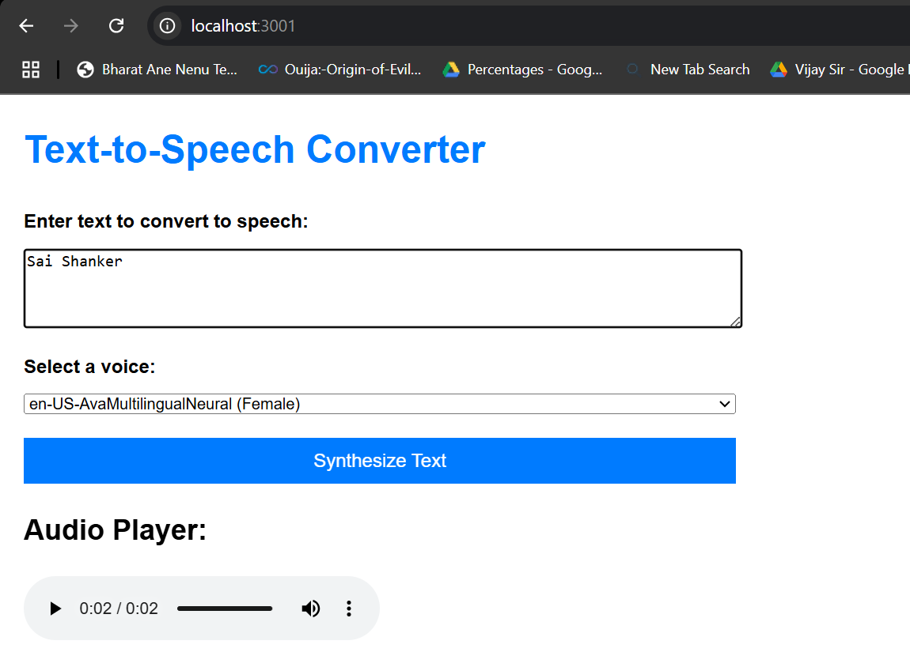
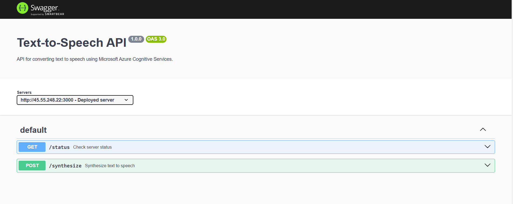
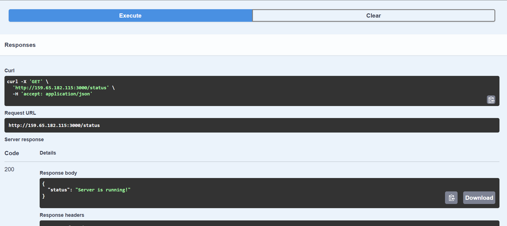
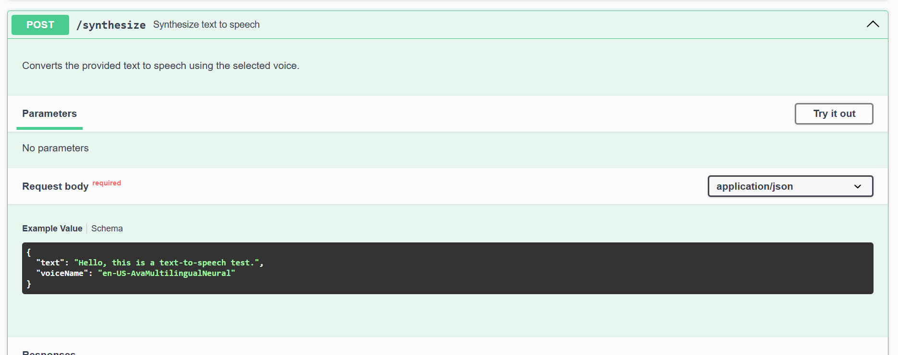
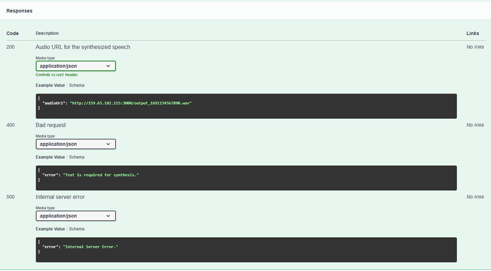

# Text-to-Speech Application 

A powerful and customizable Text-to-Speech (TTS) app built with Azure Cognitive Services. Effortlessly convert text into high-quality speech and tailor the voice output to your liking.

---

##  Features

-  **Text-to-Speech Conversion**: Leverage Microsoft Azure Cognitive Services to convert text into natural-sounding speech.
-  **High-Quality Output**: Generate and download audio files in crisp `.wav` format.
-  **Interactive API Documentation**: Explore and test APIs with Swagger UI.
-  **CORS Enabled**: Access the API from anywhere with Cross-Origin Resource Sharing.
-  **Flexible Deployment**: Run locally or host on the cloud seamlessly.

---

## Screenshots

### *Live Demo UI*
 

### **Swagger UI**
- API documentation interface:
  

- **GET Request**: Server status response.
  

- **POST Request**: Audio synthesis API example.
  

### **Audio File Example**
- Sample audio file responses via Swagger:
  

---

## Prerequisites

Before you get started, ensure you have the following:

1. **Node.js** (v16 or newer is recommended)
2. **NPM** (comes with Node.js)
3. **Azure Cognitive Services Speech Subscription Key**
   - [Sign up for Azure Cognitive Services](https://azure.microsoft.com/en-us/products/ai-services/)

---

##  Installation

### 1. Clone the repository
```bash
git clone https://github.com/SaiShankerJaina/System-Integration-Final-Project.git 
cd Text-to-Speech-JS


**2. Install dependencies:**

```
npm install
```

**3. Create a .env file with your Azure Speech Service credentials:**

```
SPEECH_KEY=your-azure-speech-key
SPEECH_REGION=your-azure-speech-region
```
>  **Note:** Replace `your-azure-speech-key` and `your-azure-speech-region` with your actual speech key and region obtained from Azure Cognitive Services Speech Subscription Key

**4. Ensure a public folder exists to store generated audio files:**

```
mkdir public
```

>  **Note:** Make sure to change the URLs to `http://localhost:3000` to avoid issues or confusion while running it locally.

**5. Run the app:**

```
node app.js
```
or use PM2 for process management:

```
pm2 start app.js --name text-to-speech
```

#  Usage through UI or Web Interface.

**1. Access the UI or Web Interface at:**

```
http://localhost:3000
```

**Screenshot of UI or Web Interface for referrence**


**2. Enter the text in the text field, select the voice from the drop down and click on "Synthesize Text"**

**3. The Audio file will be played using the "Audio player" below the Synthesize Text button.**

#  Usage through Swagger API documentation.

**1. Access the Swagger API documentation at:**

```
http://localhost:3000/api-docs
```

**2. Use the /synthesize endpoint to convert text to speech:**

    - Example cURL command:
```
curl -X POST http://localhost:3000/synthesize \
-H "Content-Type: application/json" \
-d '{
  "text": "Hello, this is a test.",
  "voiceName": "en-US-AvaMultilingualNeural"
}'
```

**3. Receive the audio URL in the response:**

```
{
  "audioUrl": "http://localhost:3000/output_123456789.wav"
}
```


# Deployment on DigitalOcean

1. Set up your server with a CentOS or Ubuntu image.

2. Install Node.js, NPM, and PM2.

>  **Note:** Make sure to change the URLs to `http://<your-domain-address:3000>` in the code to avoid issues or confusion while hosting in cloud service.
> You can do this by searching for all instances starting with `http://` addresses and replace the complete address with `http://<your-domain-address:3000>`
3. Clone this repository onto your server:

```
git clone https://github.com/SaiShankerJaina/System-Integration-Final-Project.git 
cd Text-to-Speech-JS
npm install
```
4. Configure the .env file with Azure credentials.
   - Check the Step 3 in Installation to create the .env file

5. Start the app using PM2:

```
pm2 start app.js --name text-to-speech
```

6. Set up a reverse proxy (e.g., NGINX) for secure HTTP requests.

# Demo

Check out the deployed version here: [Live Demo](http://159.65.182.115:3000/)
and deployed Swagger Documentation here: [Live Swagger Documentation](http://159.65.182.115:3000/api-docs/)

- Refer to the usage steps to explore the demo of the UI or Web interface and Swagger API documentation.


# Tech Stack

- **Backend:** Node.js, Express.js

- **API Documentation:** Swagger UI

- **Speech Services:** Microsoft Azure Cognitive Services

- **Process Management:** PM2


