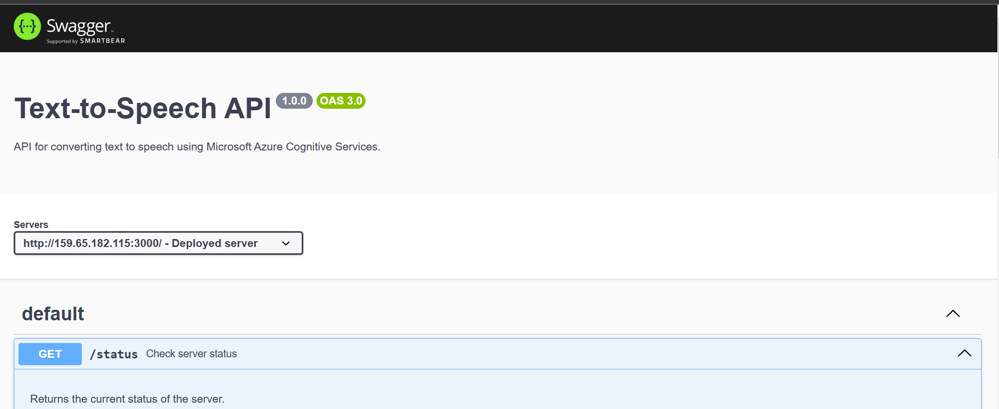

# 🌟 Text-to-Speech Application 🎤

A feature-rich Text-to-Speech (TTS) application powered by Azure Cognitive Services. Convert text into speech effortlessly and customize voices to your preference. 🌍✨

# 🚀 Features

- 🎙️ Convert text into speech using Microsoft Azure Cognitive Services.

- 🔊 Outputs audio files in high-quality .wav format.

- 📜 API documentation with Swagger UI.

- 🌐 Cross-Origin Resource Sharing (CORS) enabled for API access.

- 📦 Easily deployable on local and cloud environments.


# 🖼️ Screenshots

### Swagger UI
- Swagger API Documentation Screenshot.

- Get Request which gives the status of the server.

- Post Request which gives the synthesize audio file as output.


### Audio File Example Responses on Swagger UI


# 📋 Prerequisites
1. Node.js (v16 or later recommended)

2. NPM (comes with Node.js)

3. An Azure Cognitive Services Speech Subscription Key

    - [Sign up for Azure Cognitive Services](https://azure.microsoft.com/en-us/products/ai-services/)

# 🛠️ Installation
**1. Clone the repository:**

```
git clone  https://github.com/SaiShankerJaina/System-Integration-Final-Project.git 
cd Text-to-Speech-JS
```

**2. Install dependencies:**

```
npm install
```

**3. Create a .env file with your Azure Speech Service credentials:**

```
SPEECH_KEY=your-azure-speech-key
SPEECH_REGION=your-azure-speech-region
```
> ⚠️ **Note:** Replace `your-azure-speech-key` and `your-azure-speech-region` with your actual speech key and region obtained from Azure Cognitive Services Speech Subscription Key

**4. Ensure a public folder exists to store generated audio files:**

```
mkdir public
```

> ⚠️ **Note:** Make sure to change the URLs to `http://localhost:3000` to avoid issues or confusion while running it locally.

**5. Run the app:**

```
node app.js
```
or use PM2 for process management:

```
pm2 start app.js --name text-to-speech
```

# 🔗 Usage through UI or Web Interface.

**1. Access the UI or Web Interface at:**

```
http://localhost:3000
```

**Screenshot of UI or Web Interface for referrence**


**2. Enter the text in the text field, select the voice from the drop down and click on "Synthesize Text"**

**3. The Audio file will be played using the "Audio player" below the Synthesize Text button.**

# 🔗 Usage through Swagger API documentation.

**1. Access the Swagger API documentation at:**

```
http://localhost:3000/api-docs
```

**2. Use the /synthesize endpoint to convert text to speech:**

    - Example cURL command:
```
curl -X POST http://localhost:3000/synthesize \
-H "Content-Type: application/json" \
-d '{
  "text": "Hello, this is a test.",
  "voiceName": "en-US-AvaMultilingualNeural"
}'
```

**3. Receive the audio URL in the response:**

```
{
  "audioUrl": "http://localhost:3000/output_123456789.wav"
}
```


# 🌍 Deployment on DigitalOcean

1. Set up your server with a CentOS or Ubuntu image.

2. Install Node.js, NPM, and PM2.

> ⚠️ **Note:** Make sure to change the URLs to `http://<your-domain-address:3000>` in the code to avoid issues or confusion while hosting in cloud service.
> You can do this by searching for all instances starting with `http://` addresses and replace the complete address with `http://<your-domain-address:3000>`
3. Clone this repository onto your server:

```
git clone https://github.com/SaiShankerJaina/System-Integration-Final-Project.git 
cd Text-to-Speech-JS
npm install
```
4. Configure the .env file with Azure credentials.
   - Check the Step 3 in Installation to create the .env file

5. Start the app using PM2:

```
pm2 start app.js --name text-to-speech
```

6. Set up a reverse proxy (e.g., NGINX) for secure HTTP requests.

# 🔥 Demo

Check out the deployed version here: [Live Demo](http://45.55.248.22:3000/)
and deployed Swagger Documentation here: [Live Swagger Documentation](http://45.55.248.22:3000/api-docs/)

- Refer to the usage steps to explore the demo of the UI or Web interface and Swagger API documentation.


# 🧰 Tech Stack

- **Backend:** Node.js, Express.js

- **API Documentation:** Swagger UI

- **Speech Services:** Microsoft Azure Cognitive Services

- **Process Management:** PM2


# 🙌 Contributing
I welcome contributions! Feel free to:

1. Fork the repository.
2. Make your changes.
3. Submit a pull request.
